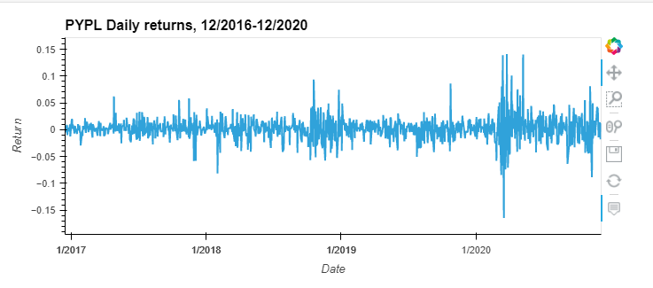
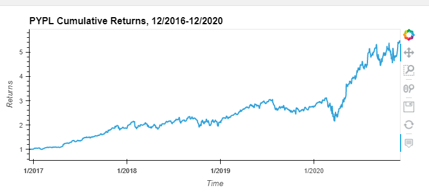
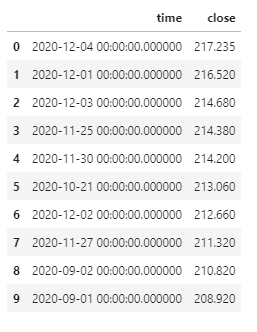
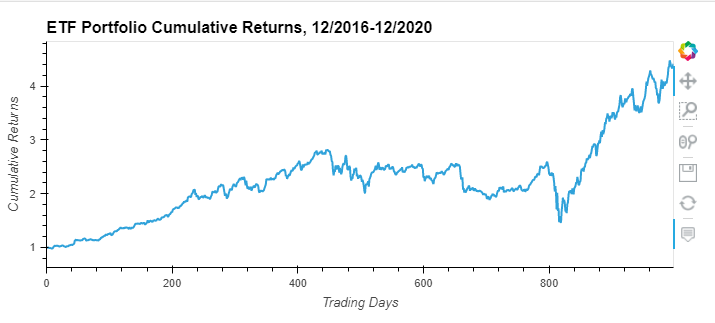

# etf_analysis

This file analyzes a hypothetical etf portfolio consisting of 4 stocks using SQL and Python. The data for each stock is contained in an accompanying .db file.

It first queries the .db file using SQL to pull all data on PYPL and chart its daily returns:

and its cumulative returns:

Next it optimizes the previous query by selecting only instances of "close" greater than 200, and then listing them in descending order and limiting to 10 entries to get the top 10 close prices (all of which presented near the end of the timeline):

Then the report analyzes the etf portfolio as a whole by using a SQL inner join to merge each of the 4 tables on the date column. The aggregated data is then used to provide the daily, annualized, and cumulative returns, respectively. It then plots the cumulative returns of the portfolio:

